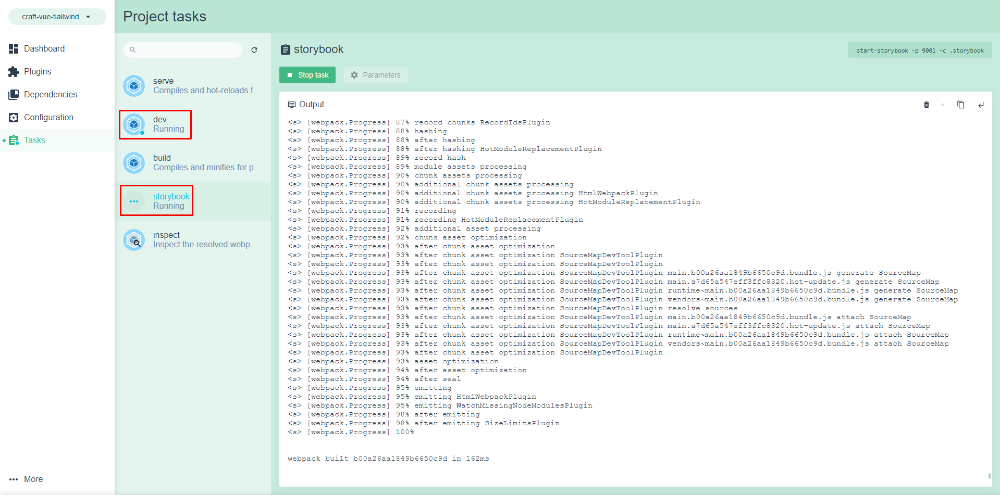
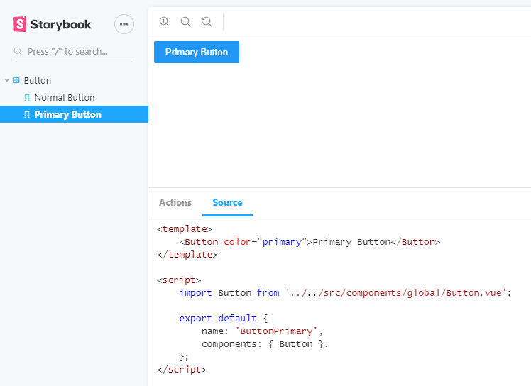
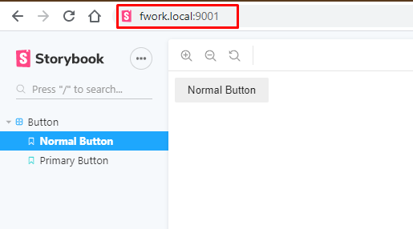

DEPRECATED: This was our initial foray into using Vue and Craft based off of the work Chase did. Archived for reference only. Use [Craft FWORK Plus](https://github.com/FosterCommerce/craft-fwork-plus) for production work.

# craft-vue-tailwind

Fork of the [craft-vue](https://github.com/chasegiunta/craft-vue) template that integrates the Tailwind CSS utility framework & removes unused CSS with Purgecss.

## What's Included

- `npm run dev` / `yarn dev`: first-in-class development experience.

  - Webpack + `vue-loader` for single file Vue components
  - State preserving hot-reload
  - Page reloading on file edits (twig, html, etc)
  - State preserving compilation error overlay
  - Lint-on-save with ESLint
  - Source maps

- `npm run build` / `yarn build`: Production ready build.
  - JavaScript minification with [UglifyJS v3](https://github.com/mishoo/UglifyJS2/tree/harmony)
  - Babel compiling
  - CSS across all components extracted into a single file and minified with [cssnano](https://github.com/ben-eb/cssnano)
  - Static assets compiled with version hashes for efficient long-term caching
  - Removes unused CSS with Purgecss. Includes whitelister to keep third-party libraries untouched.
  - Bundle size analytics

## Fork It And Make Your Own

You should fork this repo to create your own opinionated boilerplate for your setup. This template makes no assumptions about pre-processors, template structure, or linting configurations.

## Setup

This boilerplate requires Vue CLI 3 be [installed globally on your machine](https://cli.vuejs.org/guide/installation.html).

1. Run `composer install` to install Craft dependencies.
2. Create a MySQL database locally.
3. Import the database dump file at `_dev/database.sql.gz` into your database. (on Mac/Linux `$ gunzip _dev/database.sql.gz`)
4. Set up a web server locally and create a host name that points to the `/web` directory
5. Create and configure a `.env` file using [`.env.example`](/.env.example) as an example*.
6. Run `npm install` to install front end build chain dependencies.

Once up and running, the fun part comes in using Vue CLI's GUI to customize your project to suite your needs. Simply run `vue ui` and import your newly created project to get started.

You can also run your `dev` & `build` tasks from the GUI to get valuable build stats & runtime analytics.

**NOTE:** During development, _only your assets_ will be served from `localhost:8080` and referenced in the base template. You'll still load your site locally under your normal development domain (mysite.test, etc.). This will also cause a brief unstyled flash on page loads due to JS/CSS assets loading from javascript for development. **This flash isn't present after build, on production**.

If webpack's dev server is not running, Twigpack will serve your assets from the build directory.

For a detailed explanation on how things work, check out the [Twigpack docs](https://github.com/nystudio107/craft-twigpack) & [Vue CLI docs](https://cli.vuejs.org/).

Note you also need to install node-sass because sass-loader depends on it as a peer dependency.

Read more about this at https://cli.vuejs.org/guide/css.html#pre-processors

## Storybook
1. Inside Vue CLI (`vue ui` from the command line), select "storybook" from the project tasks and click "Run task"
2. To view the Storybook frontend, visit localhost:9001



## Automatic Component Registration

Any vue components placed within `src/components` will be registered with Vue automatically. You may nest these in subfolders if you wish.

## Babel Compiling

This boilerplate uses babel-preset-env for configuring babel. [You can read more about it here.](https://cli.vuejs.org/config/#babel)

## Linting

You can enable linting by adding the `@vue/cli-plugin-eslint` plugin through the GUI `vue ui`.

# Building a Storybook Component

_See the **Storybook Code Examples** section below the following list for further reading._

1. Under `/src/components`, create `YourComponent.vue`. This is the main component (like an organism), and all of your atoms of that component will be brought into here. 
2. Under `/stories`, create a directory `your-component` with `YourAtom.story.vue`. Repeat this for all of the atoms in your component.
3. Under `/stories/your-component`, create `YourComponent.stories.js`, import your atoms from step 2, and create your exports.

## Storybook Code Examples

`/src/components/Button.vue`

```html
<template>
    <button class="button" :class="`button-color--${color}`">
        <slot></slot>
    </button>
</template>

<script>
    export default {
        name: 'Button',
        props: {
            color: {
                type: String,
                default: 'normal', // 'normal' or 'primary'
            },
        },
    };
</script>

<style type="scss" scoped>
    .button {
        appearance: none;
        border: none;
        font-family: sans-serif;
        padding: 8px 16px;
        border-radius: 2px;
    }

    .button-color {
    
        &--normal {

            background-color: #eee;
            color: #222;

            &:active {
                background-color: #bdbdbd;
            }

            &:hover,
            &:focus {
                background-color: #e0e0e0;
            }

        }

        &--primary {

            background-color: #2196f3;
            color: #fff;

            &:active {
                background-color: #1976D2;
            }

            &:hover,
            &:focus {
                background-color: #1e88e5;
            }

        }

    }
</style>
```

`/stories/button/ButtonNormal.story.vue`

```html
<template>
    <Button>Normal Button</Button>
</template>

<script>
    import Button from '../../src/components/Button.vue';

    export default {
        name: 'ButtonNormal',
        components: { Button },
    };
</script>

<include-source>stories/button/ButtonNormal.story.vue</include-source>
```

`/stories/button/ButtonPrimary.story.vue`

```html
<template>
    <Button color="primary">Primary Button</Button>
</template>

<script>
    import Button from '../../src/components/Button.vue';

    export default {
        name: 'ButtonPrimary',
        components: { Button },
    };
</script>

<include-source>stories/button/ButtonPrimary.story.vue</include-source>
```

`/stories/button/Button.stories.js`

```javascript
import { story } from '../story';
import ButtonNormal from './ButtonNormal.story.vue';
import ButtonPrimary from './ButtonPrimary.story.vue';

export default {
    title: 'Button',
};

export const normalButton = story(ButtonNormal);
export const primaryButton = story(ButtonPrimary);
```

Now, navigate over to http://localhost:9001/ and you should see this:



More info: https://dev.to/josephuspaye/using-storybook-with-vue-single-file-components-2od

## Sharing Storybook with Clients

1. On the staging server, run `start-storybook -p 9001 -c .storybook`
2. Navigate to the the staging URL at port 9001 (example: staging.myclient.com:9001)


